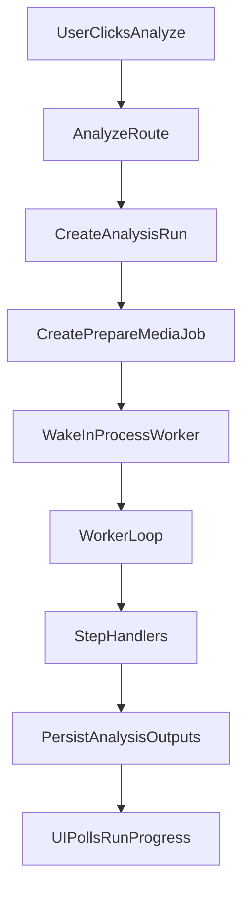
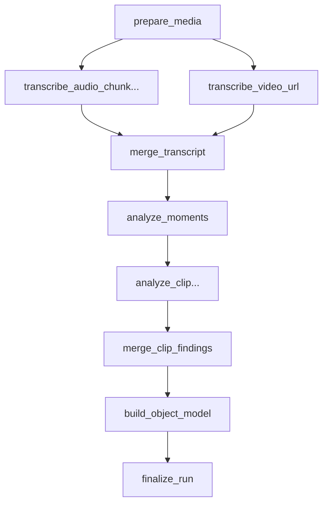
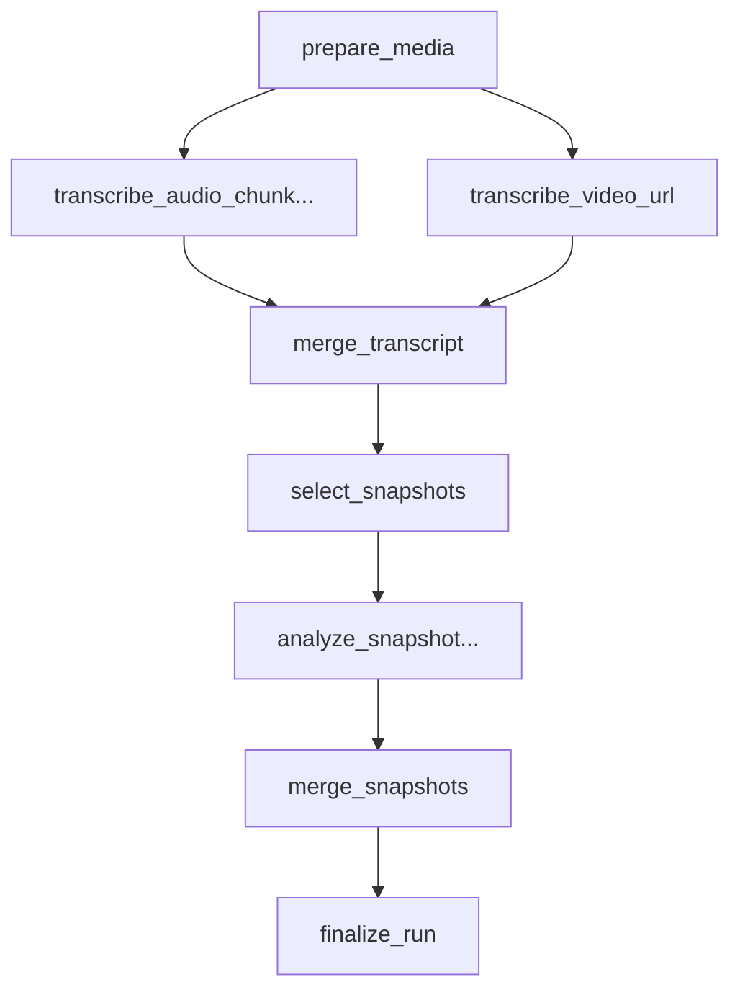

# Architecture

## Overview

PM Video Analyzer is a persisted video-analysis workspace built on Next.js App Router.

At a high level, the system has five major layers:

1. UI routes and API routes in `app/`
2. Client views in `components/`
3. Durable metadata and outputs in Postgres via `lib/server/db.ts`
4. Media processing and storage in `lib/server/ffmpeg.ts`, `lib/server/storage.ts`, and `lib/server/youtube.ts`
5. Gemini-backed analysis steps coordinated by a queued background pipeline in `lib/server/analysis-pipeline.ts` and `lib/server/analysis-worker.ts`

## Request And Processing Model

Analysis no longer runs inline inside a single HTTP request.

The current flow is:

The API returns quickly after enqueueing a run. The background worker then claims jobs from Postgres and executes them with bounded concurrency.

## Main Entry Points

### Pages

- `app/page.tsx`
  - Dashboard page for uploads, list view, and run initiation.
- `app/videos/[videoId]/page.tsx`
  - Detail page for playback, transcript, moments, snapshots, and reports.

### API routes

- `app/api/videos/route.ts`
  - Lists videos and creates persisted video records from file uploads, blob references, or YouTube URLs.
- `app/api/videos/[videoId]/route.ts`
  - Returns the full persisted detail model for one video.
- `app/api/videos/[videoId]/analyze/route.ts`
  - Enqueues a new run for an existing video.
- `app/api/analyze/route.ts`
  - Convenience route that creates a video and then enqueues analysis in one request.
- `app/api/videos/[videoId]/reports/[reportType]/route.ts`
  - Returns persisted JSON or HTML reports.
- `app/api/videos/[videoId]/export/route.ts`
  - Exports selected local clips.
- `app/api/local-storage/[...storageKey]/route.ts`
  - Serves local artifacts when Blob is not configured.

## Frontend Architecture

### `components/video-dashboard.tsx`

Responsibilities:

- create videos from file, Blob, or YouTube
- list saved videos
- enqueue analysis runs
- poll run progress when any video has a queued or processing run

### `components/video-detail.tsx`

Responsibilities:

- render playback and analysis outputs
- allow `pm_report` vs `analyze` mode selection
- enqueue analysis for a single video
- poll for run progress until completion or failure
- show transcript, moments, snapshots, and reports

The detail page is intentionally read-heavy. Most write operations happen through API routes rather than direct server actions.

## Persistence Model

The authoritative persistence layer is `lib/server/db.ts`.

### Core domain tables

- `videos`
  - one row per saved source video
- `artifacts`
  - source videos, boosted audio, screenshot images
- `analysis_runs`
  - one row per run, including high-level status, mode, prompt, stage, and config version
- `transcript_segments`
- `screenshot_frames`
- `flow_steps`
- `moments`
- `memory_entities`
- `memory_relationships`
- `reports`

### Queue / pipeline tables

- `analysis_jobs`
  - each executable unit in the pipeline
- `analysis_job_dependencies`
  - prerequisite edges between jobs
- `analysis_run_outputs`
  - intermediate results used for fan-out/fan-in stages

### Why two layers of persistence exist

The final domain tables are optimized for reads by the UI.

The queue tables are optimized for:

- resumable processing
- job retries
- parallel branch tracking
- deterministic merge points before final persistence

## Background Worker

The worker implementation lives in `lib/server/analysis-worker.ts`.

Key properties:

- in-process worker loop
- started lazily from API and read routes through `ensureAnalysisWorkerRunning()`
- claims runnable jobs from Postgres
- applies per-job-type concurrency limits
- retries retryable jobs with delay
- marks the full run failed when a terminal job failure occurs

### Current concurrency controls

Default limits:

- total worker concurrency: `4`
- transcription jobs: `3`
- clip analysis jobs: `2`
- snapshot analysis jobs: `3`

These can be tuned with environment variables:

- `ANALYSIS_WORKER_CONCURRENCY`
- `ANALYSIS_TRANSCRIBE_CONCURRENCY`
- `ANALYSIS_CLIP_CONCURRENCY`
- `ANALYSIS_SNAPSHOT_CONCURRENCY`

## Analysis Pipeline

The step handlers live in `lib/server/analysis-pipeline.ts`.

### Shared phases

1. `prepare_media`
   - resolve the source type
   - materialize local or YouTube media when needed
   - extract boosted mono WAV audio with ffmpeg
   - store boosted audio as an artifact
2. `merge_transcript`
   - merge chunk outputs into a deterministic ordered transcript
3. final persistence
   - write final outputs into UI-facing tables

### PM report mode

Detailed behavior:

- transcript is the global context
- moments and flow are inferred from the full transcript
- selected moments fan out into targeted clip jobs
- clip findings are merged back into the moment set
- object model is derived from transcript plus clip findings
- reports are generated during finalization

### Analyze mode

Detailed behavior:

- transcript is generated first
- Gemini selects the most relevant timestamps for the user prompt
- snapshot jobs fan out per selected timestamp
- local files use true frame extraction plus screenshot understanding
- YouTube URLs use short time-window visual analysis
- final output is a transcript plus note/snapshot set, not bug tickets or object model data

## Fan-Out / Fan-In Strategy

Parallel stages are intentionally bounded, not unbounded.

### Transcription

Defined in `lib/analysis/transcribe.ts`.

- audio is chunked with ffmpeg
- each chunk becomes its own transcription job
- results are written to `analysis_run_outputs` under `transcript_chunk:*`
- merge step sorts by `chunkIndex`

### Clip analysis

- top moments are limited by `MAX_CLIP_ANALYSES`
- each selected moment becomes an `analyze_clip` job
- outputs are keyed by original moment index
- merge step rehydrates enriched moments in stable order

### Snapshot analysis

- selected snapshots are limited by `MAX_PROMPTED_SNAPSHOTS`
- each selected timestamp becomes an `analyze_snapshot` job
- outputs are keyed by selected snapshot index
- merge step produces a stable ordered note set

## Media And Storage Architecture

### `lib/server/storage.ts`

Handles:

- Blob-backed writes when `BLOB_READ_WRITE_TOKEN` is available
- local filesystem writes under `.data/storage` otherwise
- artifact materialization for processing
- artifact deletion

### `lib/server/ffmpeg.ts`

Handles:

- boosted audio extraction
- audio chunking
- targeted clip extraction
- frame extraction

The ffmpeg resolver intentionally prefers the real installed binary under `node_modules/ffmpeg-static/ffmpeg` to avoid Next.js server-bundle path issues.

### `lib/server/youtube.ts`

Handles:

- best-effort YouTube download with `yt-dlp`
- optional cookie/user-agent configuration
- helpful error messages for anti-bot failures

## Reporting Layer

`lib/server/reports.ts` has two roles:

1. build structured report content from analyzed outputs
2. render persisted HTML variants for download/viewing

Current report families:

- bug ticket report
- timeline report
- object model report

## Run Status Model

The UI reads one high-level `analysis_runs` row but also derives progress from associated jobs.

Current run progress fields include:

- total, queued, processing, completed, failed, cancelled job counts
- transcription job counts
- clip job counts
- snapshot job counts

Older runs created before the queue refactor will legitimately show zero job counts because they do not have `analysis_jobs` history.

## Development Notes

### Hot rebuilding

- `npm run dev` uses webpack-backed `next dev`
- `npm run dev:turbo` uses `next dev --turbopack`
- `next.config.ts` uses separate dist directories so webpack and Turbopack do not corrupt each other's artifacts

### Worker model in development

There is currently no separate `npm run worker` process.

Instead:

- the Next.js server starts the in-process worker on demand
- API and read routes call `ensureAnalysisWorkerRunning()`
- restarting the dev server also restarts the worker

## Operational Caveats

- Very long runs still depend on the app server staying alive because the worker is in-process, even though work is durable in Postgres.
- Local temp media is stored per run in the OS temp directory and cleaned up when the run finishes or fails.
- YouTube analyze mode is still less reliable than local-file analyze mode because it may require server-side download.
- Final UI-facing outputs are only persisted after successful fan-in and finalization.

## Suggested Future Improvements

- move the worker into a dedicated process with `npm run worker`
- add explicit heartbeat / lease renewal for long-running jobs
- add partial-result inspection endpoints for debugging
- add admin views for queued jobs and failed dependencies
- support resumable reruns from intermediate artifacts instead of restarting from `prepare_media`
